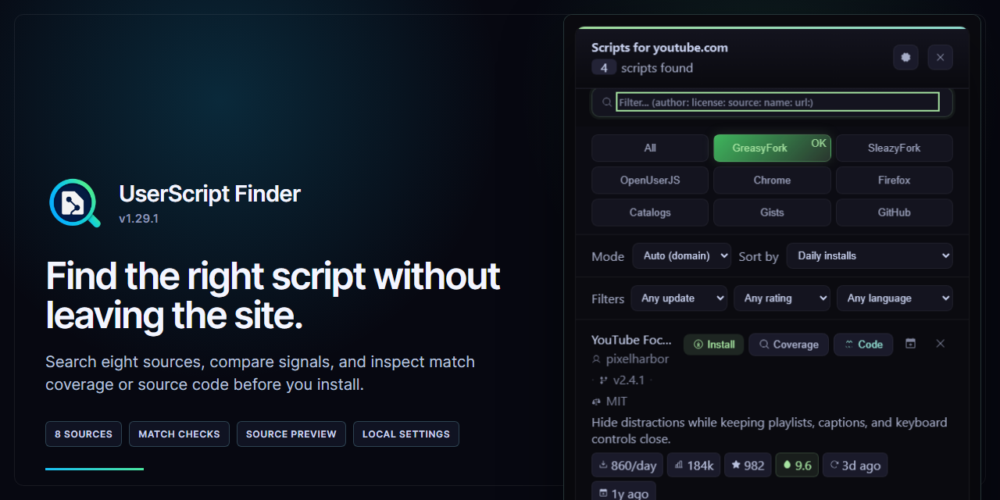
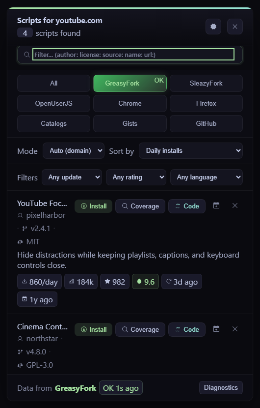
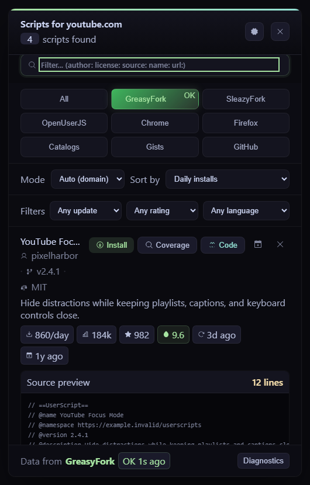
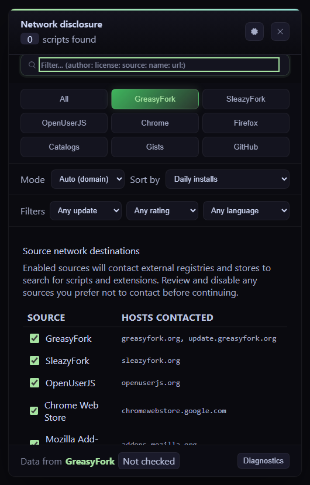
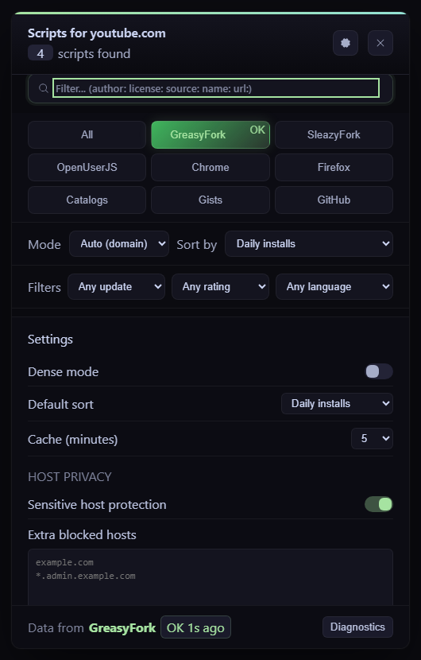

<p align="center">
  
</p>

<h1 align="center">UserScript Finder</h1>

<p align="center"><strong>Find the right browser script without leaving the site.</strong></p>

<p align="center">
  
  
  
</p>

<p align="center">
  <a href="https://raw.githubusercontent.com/SysAdminDoc/UserScript-Finder/main/UserScript-Finder.user.js"><strong>Install UserScript Finder</strong></a>
  · <a href="#see-it-in-action">Screenshots</a>
  · <a href="#what-it-searches">Sources</a>
  · <a href="#safety-before-installation">Safety</a>
</p>

UserScript Finder adds a compact search panel to your userscript manager. Open it on any website to compare domain-matched userscripts, browser extensions, curated catalogs, Gists, and GitHub repositories from one place.

No search request is sent until you open the finder. On first use, it shows every external host that each enabled source will contact and lets you disable sources before continuing.

<p align="center">
  
</p>

## Install

1. Install [Tampermonkey](https://www.tampermonkey.net/) or [Violentmonkey](https://violentmonkey.github.io/).
2. Open the [UserScript Finder installer](https://raw.githubusercontent.com/SysAdminDoc/UserScript-Finder/main/UserScript-Finder.user.js) and approve it in your userscript manager.
3. Visit a website, open the manager menu, and choose a `Find Scripts` or `Find Extensions` command.

The finder has no permanent page button. It stays out of the way until you choose a menu command.

## See it in action

<table>
  <tr>
    <td width="50%"></td>
    <td width="50%"></td>
  </tr>
  <tr>
    <td align="center"><sub>Compare installs, ratings, freshness, and author details.</sub></td>
    <td align="center"><sub>Read bounded, highlighted source before the install handoff.</sub></td>
  </tr>
  <tr>
    <td width="50%"></td>
    <td width="50%"></td>
  </tr>
  <tr>
    <td align="center"><sub>Review network destinations before the first request.</sub></td>
    <td align="center"><sub>Keep searches local to the sources and hosts you allow.</sub></td>
  </tr>
</table>

Screenshots are rendered by the production userscript with deterministic sample results. The same capture script is included in this repository.

## What it searches

| Source | Finds | Useful signals |
|---|---|---|
| **GreasyFork** | Domain-matched userscripts | Daily installs, total installs, ratings, update age |
| **SleazyFork** | Domain-matched userscripts | The same registry signals, in a separately controlled source |
| **OpenUserJS** | Userscripts from site search | Installs, ratings, update age |
| **Chrome Web Store** | Chrome extension alternatives | Users, rating, permissions, host access, privacy metadata |
| **Mozilla AMO** | Firefox extension alternatives | Users, rating, permissions, data flags, promoted status |
| **Catalogs** | Awesome Userscripts and Userscript.Zone results | Catalog and category context |
| **GitHub Gists** | Installable or view-only userscript Gists | Files, stars, forks, last activity |
| **GitHub** | Related userscript repositories | Stars, forks, language |

Choose one source from the userscript manager menu, then switch tabs or use **All** to compare enabled sources together. All-source results are deduplicated by URL.

## Safety before installation

- **Inspect the network plan.** First-run disclosure lists source hosts before fetching anything.
- **Check page coverage.** The finder reads `@match`, `@include`, and `@exclude` metadata against the current URL.
- Install URLs must use an approved host and include a valid userscript metadata block. Unsafe candidates become view-only results with a clear reason.
- Open a bounded source preview in the panel. Syntax highlighting is applied only after the source is safely escaped.
- Sensitive host protection blocks menus and searches on common banking, government, identity, administrator, localhost, and private-network hosts. Per-host overrides remain available.

UserScript Finder does not install code itself. A validated candidate is handed to your userscript manager, where you review and approve the final installation.

## Search and compare

| Control | Options |
|---|---|
| Search mode | Automatic domain, exact host, root domain, or keyword |
| Sort | Daily installs, total installs, ratings, fan score, author reputation, updated, or created |
| Filters | Update window, normalized minimum rating, browser language, or English |
| Field search | `author:`, `license:`, `source:`, `name:`, and `url:` |
| Result actions | Install, check coverage, preview code, queue for later, or dismiss |

Source health labels distinguish fresh results from cache, stale fallback, partial responses, rate limits, and failures. Diagnostics contain source status and timing without exporting browsing history or fetched source.

## Privacy and storage

Settings, dismissed results, and the try-later queue stay in your userscript manager storage. There is no UserScript Finder account and no hosted project server.

Each source can be disabled independently. A disabled source disappears from menus and tabs, and the finder makes no requests to its hosts. Settings changes also sync across open tabs when the manager supports value-change listeners.

The complete network allowlist is visible in the userscript header and checked against the source adapter registry by the test suite.

## Compatibility

| Manager | Support |
|---|---|
| Tampermonkey | Full menu, request, storage, tab, and source-preview support |
| Violentmonkey | Full support through the same GM API surface |
| Greasemonkey or partial managers | A compatibility report explains unavailable capabilities instead of failing silently |

The script runs at `document-idle` and uses Shadow DOM to isolate its panel from the website. Trusted Types handling covers strict CSP pages.

## Troubleshooting

**The menu is missing:** confirm that the userscript is enabled, refresh the page, and open the userscript manager menu again. The script does not add a floating page button.

**A source is rate limited:** switch to another tab or use cached results, then retry when the source health label permits it.

**Results are too broad:** switch from automatic mode to exact host, then use the update and rating filters.

**The current site is blocked:** sensitive host protection explains the matched pattern. Add a deliberate host override only when you trust the page and its network context.

## Development

```bash
npm install
npm test
node --check UserScript-Finder.user.js
npm run capture:marketing
```

`npm test` runs 19 serial tests covering adapters, install safety, matching, host privacy, disclosure, accessibility, source previews, storage limits, and desktop or mobile layout behavior.

To add a source, implement its adapter, register it in `SOURCE_META`, declare its hosts in `SOURCE_CONNECT` and the `@connect` header, then add a fixture-backed contract test. The allowlist audit rejects undocumented or orphaned hosts.

## License

UserScript Finder is available under the [MIT License](LICENSE).
